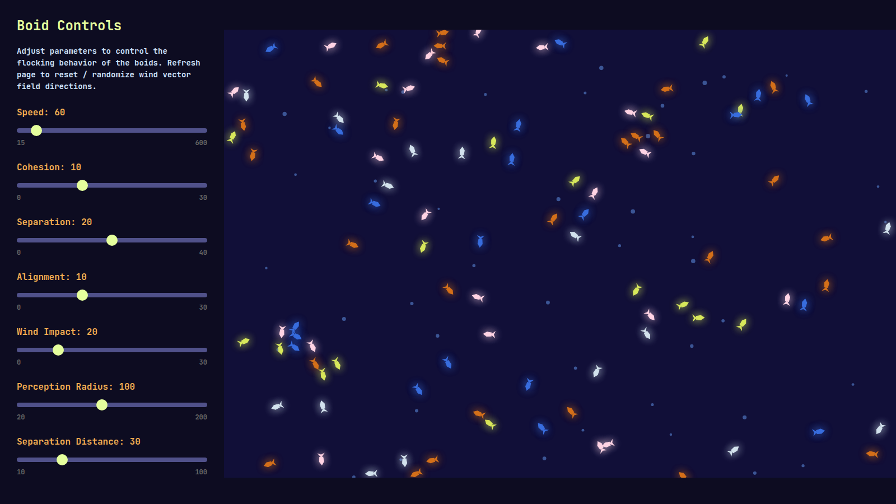
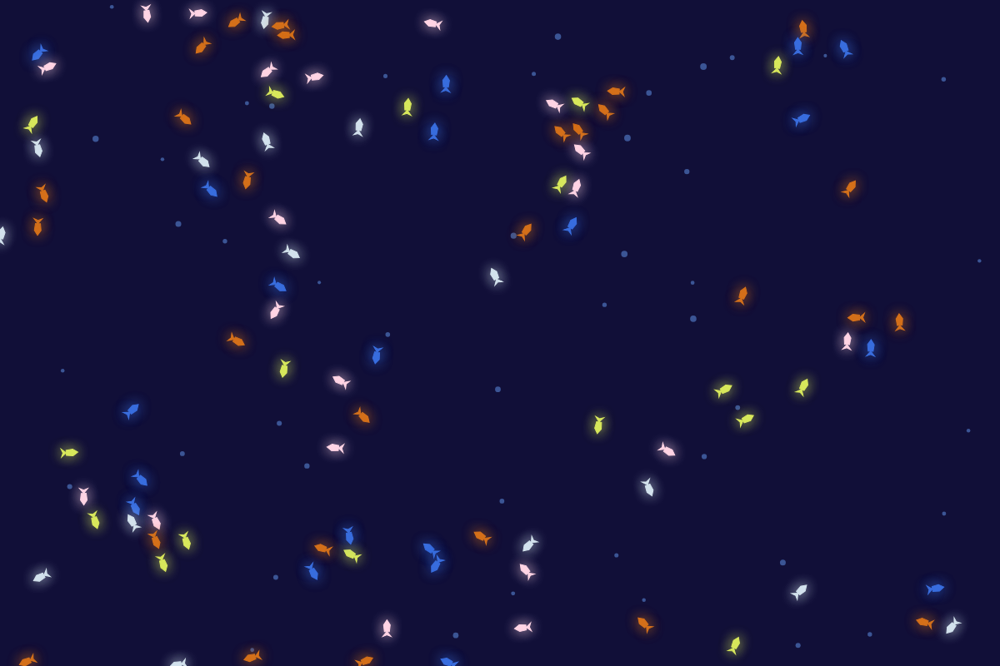
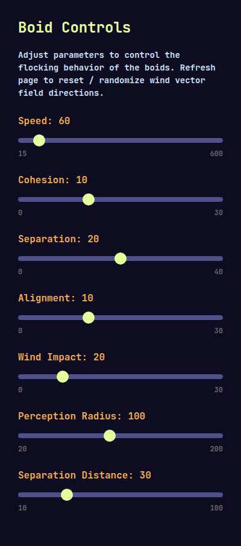
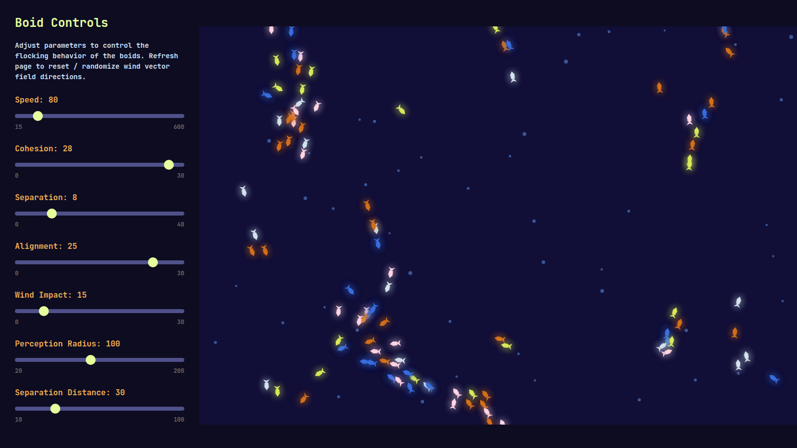
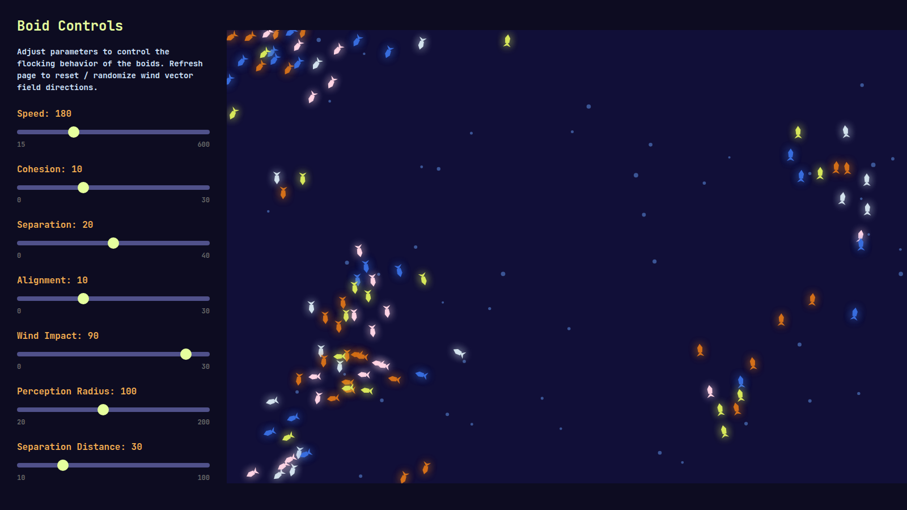

# simpleboid

An interactive flocking simulation — glowing fish-like boids that steer, school, and drift through a wind field you can tune live.

Built by [cm30w](https://github.com/cm30w) as a small canvas experiment in classic [boids](https://en.wikipedia.org/wiki/Boids) rules (separation, alignment, cohesion), plus a 3×3 wind vector field.



---

## About

**simpleboid** is a browser-only demo: open the page, watch ~100 agents move, and drag sliders to feel how each force changes the flock. No install, no build step — just HTML, CSS, and vanilla JavaScript.

Each boid:

- **Separates** from neighbors that get too close  
- **Aligns** with nearby headings  
- **Coheres** toward the local group center  
- Feels **wind** from whichever zone of the 3×3 field it is in  

Wind directions are randomized on load. Refresh the page anytime to reshuffle the wind field and reset the scene.



---

## Quick start

1. Clone or download this repo.
2. Open `index.html` in a browser, **or** serve the folder locally:

```bash
python3 -m http.server 8000
```

3. Visit `http://localhost:8000`.

That’s it — the simulation starts immediately.

---

## Interface tour

The layout has two parts:

| Area | What it is |
|------|------------|
| **Left — Boid Controls** | Sliders that update flock behavior in real time |
| **Right — Canvas** | The live simulation (fish-shaped boids + faint wind particles) |



---

## How to use (tutorial)

### 1. Watch the default flock

Leave the sliders alone for a few seconds. You should see loose groups form, break apart, and drift as boids react to neighbors and wind.

### 2. Change speed

Drag **Speed** up (toward 600) for a frantic school, or down (toward 15) for a slow drift. Speed sets max velocity; minimum speed stays at about 25% of that so boids never fully stop.

### 3. Tune the three classic forces

Try these one at a time so the effect is obvious:

1. Raise **Cohesion** → boids pull into denser clusters.  
2. Raise **Separation** → they keep more personal space and look “jitterier.”  
3. Raise **Alignment** → nearby boids point the same way and travel as streams.



### 4. Adjust what each boid can “see”

- **Perception Radius** — how far a boid looks for neighbors (cohesion & alignment). Larger = bigger, smoother groups.  
- **Separation Distance** — how close is “too close.” Larger = more spacing even inside a flock.

### 5. Turn up the wind

Increase **Wind Impact**. Blue particles hint at local wind; boids in each zone get pushed in that zone’s direction. High wind + high speed makes the flock feel turbulent.



### 6. Reset

Refresh the page to:

- Randomize wind zone directions again  
- Restore default slider values  
- Respawn boids in new positions  

---

## Controls reference

| Control | Range | Default | What it does |
|---------|-------|---------|--------------|
| **Speed** | 15–600 | 60 | Max movement speed (px/s). Min speed ≈ 25% of this. |
| **Cohesion** | 0–30 | 10 | Strength of steering toward nearby neighbors’ center. |
| **Separation** | 0–40 | 20 | Strength of pushing away from overcrowding. |
| **Alignment** | 0–30 | 10 | Strength of matching neighbors’ heading. |
| **Wind Impact** | 0–100 | 20 | How strongly the wind field steers each boid. |
| **Perception Radius** | 20–200 | 100 | Neighbor search distance for cohesion & alignment. |
| **Separation Distance** | 10–100 | 30 | Distance at which separation kicks in. |

---

## Project files

```
index.html      # page + control markup
boidstyle.css   # layout and slider styling
boidscript.js   # boids, wind zones, animation loop
docs/           # screenshots + capture helper
```

---

## License

See [LICENSE](LICENSE).
